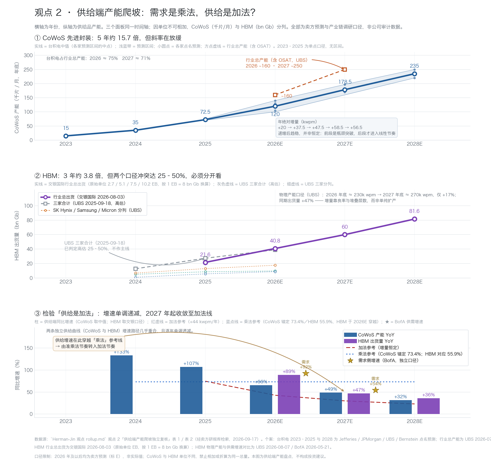
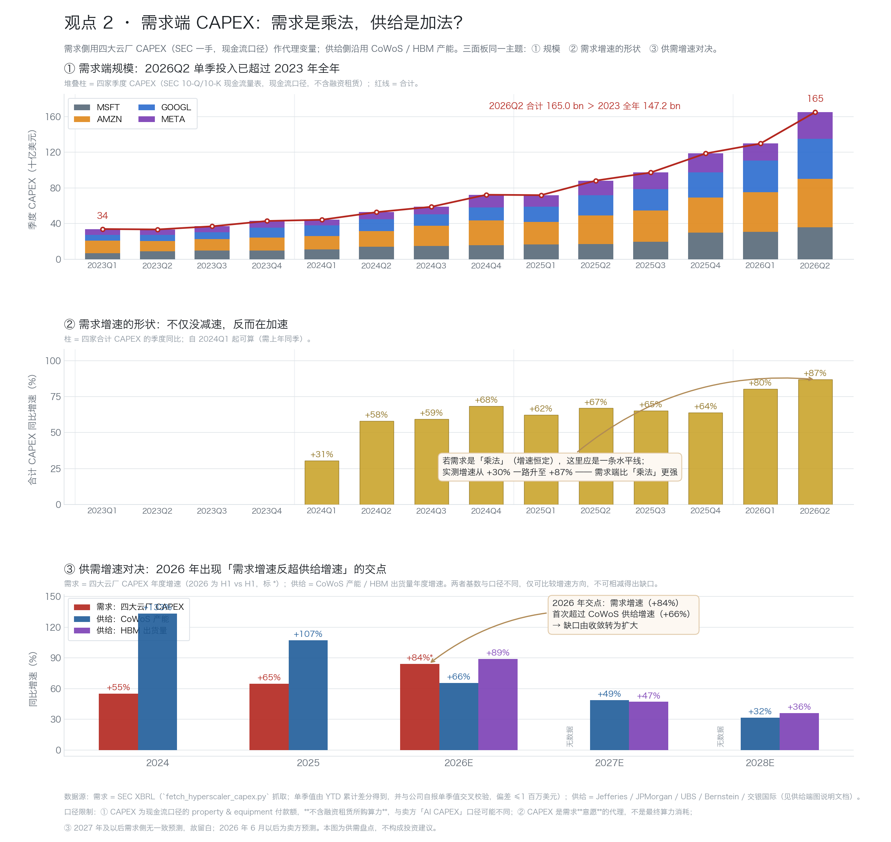
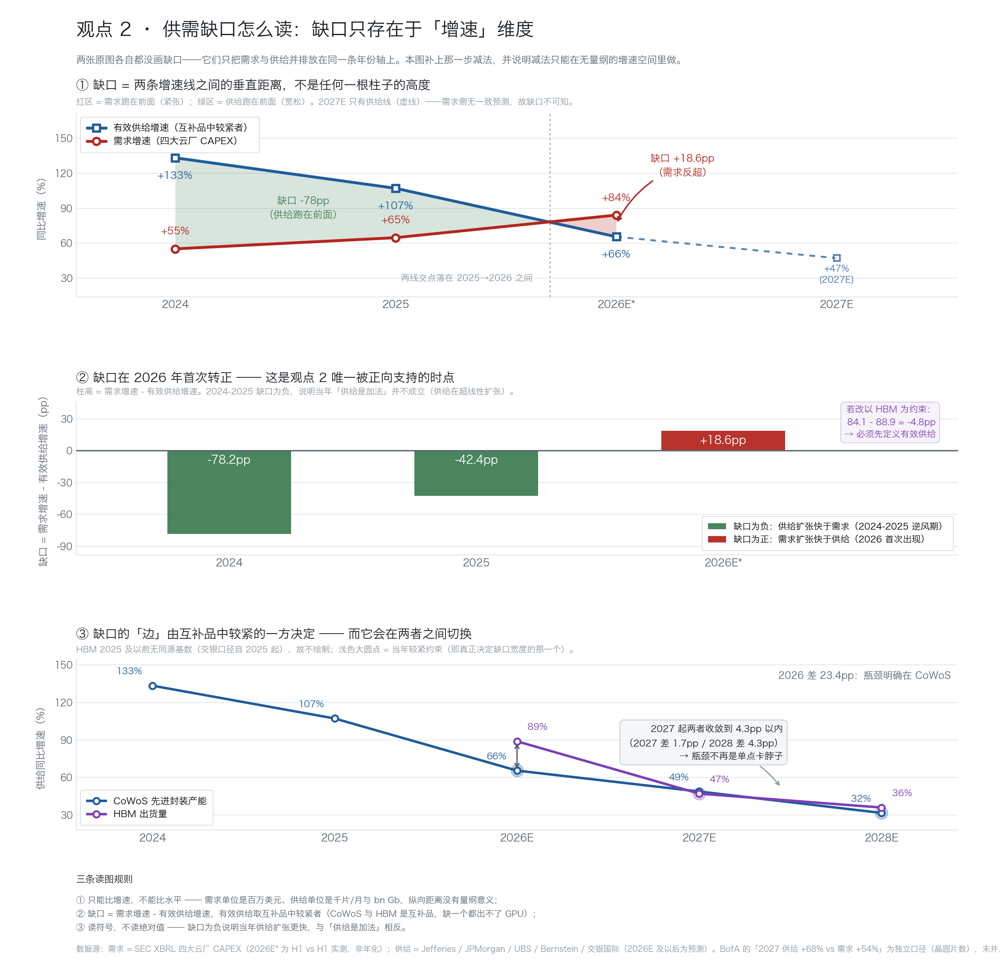

# Herman-Jin 观点 Rollup：主要观点、推理链与独立数据复核

| 项目 | 内容 |
|---|---|
| 覆盖区间 | 2025-01-07 → 2026-09-15 |
| 素材 | 59 期 market-overview；52,518 条转录 + 814 条幻灯片/OCR 记录 |
| 复核日期 | 2026-09-17 |
| 资料入口 | [agent-index](/Users/d0m999/Desktop/vibe-trading/Herman%20Jin/agent-index.json "citation") ／ [归档说明](/Users/d0m999/Desktop/vibe-trading/Herman%20Jin/_source/_pipeline/final-report.md "citation") |
| 社媒信源 | [herman-jin-社媒推荐标的与言论-2026-09-17](/Users/d0m999/Desktop/vibe-trading/research/_agent/herman-jin-%E7%A4%BE%E5%AA%92%E6%8E%A8%E8%8D%90%E6%A0%87%E7%9A%84%E4%B8%8E%E8%A8%80%E8%AE%BA-2026-09-17.md "citation")（X 长文／168X 深访／X 视频逐字引文） |
| 价格验证 | [herman-jin-core-views-price-validation-2025-2026](/Users/d0m999/Desktop/vibe-trading/Herman%20Jin/research/herman-jin-core-views-price-validation-2025-2026.md "citation") |
| 数据复核 | [Herman-Jin 观点 rollup 数据复核 2026-09-18](/Users/d0m999/Desktop/vibe-trading/research/_agent/Herman-Jin%20%E8%A7%82%E7%82%B9%20rollup%20%E6%95%B0%E6%8D%AE%E5%A4%8D%E6%A0%B8%202026-09-18.md "citation")（13 处问题 · 17 项不可核实清单 · 22 条英文 reference；修订记录见文末） |

> **证据口径**：转录与 OCR 均为自动生成，专名与数字可能误识别。本报告把高精度结论建立在多期重复、上下文与幻灯片交叉验证之上，不把单句 ASR 当作唯一证据。

> **外部数据口径**：凡引用国内/外资券商或第三方研究、且带机构名与日期的**独家测算**数字，均为〔券商测算，未经独立验证〕，不可当作审计数据使用（完整清单见数据复核报告第四节）。本报告属"可直接复核"的数字——转录行号、幻灯片 OCR、云收入增速、SEC 一手 CAPEX 序列、表内算术——不在此列。

> **阅读约定**：每个观点按同一骨架展开 —— **结论**（他的判断）→ **逻辑链**（数据源到结论的推导）→ **证据**（转录 / 幻灯片出处）→ **校准与独立复核**（价格验证、现实进度）。

---

## 目录

**总览**

- 先给结论

**核心观点**

| # | 观点 | 一句话 |
|---|---|---|
| 1 | AI 是产业革命，不是 2000 年式纯概念泡沫 | 但泡沫风险会出现在信用与 CAPEX 资金链 |
| 2 | 算力需求是“乘法”，供给是“加法” | 半导体是结构性卖方市场 |
| 3 | 短缺沿产业链轮动 | 最新扩展到电力与并网 |
| 4 | Intel 是“美国先进制造第二供应源” | 战略重估期权 |
| 5 | AI 压缩传统 SaaS，但不平均摧毁软件 | 软件内部必须分化选股 |
| 6 | 长端利率结构性偏高 | 但“加息 = 崩盘”是错误等式 |
| 7 | 美国经济是 K 型 | 高利率杀旧经济，不一定杀 AI 主线 |
| 8 | 交易时点由仓位、波动率和信用决定 | 产业多 ≠ 任何时点都能买 |
| 9 | Oracle / Hyperscaler 的真正风险 | 不是需求消失，而是债务融资与 CDS |
| 10 | 美国仍有 AI / 科技结构优势 | 欧洲弱，日本利率风险更大，中国相对受益 |

**收尾**

- 次级但反复出现的观点
- 总结：他的观点如何正确使用
- 术语框

---

## 先给结论

Herman Jin 自 2025 年以来的核心框架不是“宏观预测 → 买股票”，而是**三套时钟同时校准**：

| 时钟 | 决定什么 | 关键变量 |
|---|---|---|
| **宏观时钟** | 估值倍数与尾部风险 | 财政、关税、利率、通胀、美联储路径 |
| **产业时钟** | 中期盈利 | AI 使用量、Token、云厂商 CAPEX、先进制程／存储／CPU／电力瓶颈 |
| **交易时钟** | 什么时候被迫减仓或反手 | CTA、期权 gamma、VIX、Prime Book 仓位、信用利差 |

**最有效的部分**：第二层 —— **AI 不是平均利好所有科技股，而是沿着“最难扩产的瓶颈”逐段重定价。**

**最弱的部分**：地区／风格轮动与宏观时点。例如 2025 年初“美国相对中欧继续占优”在六个月窗口被欧洲与中国资产反证，Oracle 多头挤压判断也被后续价格反证 —— 这些校准结论见既有价格复核 [herman-jin-core-views-price-validation-2025-2026](/Users/d0m999/Desktop/vibe-trading/Herman%20Jin/research/herman-jin-core-views-price-validation-2025-2026.md "citation")。

**截至 2026-09-15 的最新状态：谨慎乐观。**

- 他认为市场把“加息导致崩盘”定价过头。
- 真正的风险不是利率水平，而是**利率波动率失控**、**AI 监管政治化**、**Hyperscaler 信用链**和**日本长端利率**。
- AI 产业主线仍未被破坏。

> 该判断综合自 2026-09-01、09-08、09-15 三期转录与幻灯片，尤其见 [transcript 2026-09-15](/Users/d0m999/Desktop/vibe-trading/Herman%20Jin/market-overview/market-overview-2026-09-15/transcript.jsonl "citation") L20-L122、L253-L532、L705-L836。

---

## 观点 1：AI 是产业革命，不是 2000 年式纯概念泡沫

*但泡沫风险会出现在信用与 CAPEX 资金链*

### 结论

**他的结论**：AI 与互联网泡沫的关键区别是“体系外已经有人付钱”——广告推荐、云收入、编程与研究工具、企业效率提升已经转化为收入和利润率，因此回调更可能是估值与仓位冲击，而不是产业逻辑终结。

- **2025-10-14 他首次系统反驳“AI 泡沫破裂论”**（2025-10-28、2025-11-18 相继重申）。
  （依据：59 期语料全量扫描——**2025-10-14 L506-L509**「你说它真的像2000年这样／2000年这样有这么大的泡沫／**我觉得没有**」；10-28 为第二次论证、11-18 第三次重申。2025-03-04 那期「泡沫」出现 12 次，但结论是"承认泡沫、建议防守"，性质相反，不计入。原记 2025-11-18，见文末修订记录。）
- 2026-09-08 又用 Microsoft、Google、Amazon 等 hyperscaler 的自有数据和 CAPEX 责任性来反驳“2000 年重演”。
- 2026-09-15 仍维持谨慎乐观。

### 逻辑链

```text
数据源：云厂商财报/指引、Microsoft 与 Alibaba 云收入、AI 相关收入、
        商业 RPO、CAPEX、自由现金流、广告推荐效率、Token 使用量
  → AI 支出不是单纯烧钱：云收入与效率提升已经开始兑现
  → 大科技公司经历过 2000 年，CAPEX 依据自有客户需求与内部数据，
    不是只依据 OpenAI/Anthropic 的外部叙事
  → 体系外真实付费存在，和 2000 年“没有收入、只靠资本市场输血”不同
  → 所以“AI 已经是 2000 年泡沫顶部”不成立
  → 但若 CAPEX 超过自由现金流、债务融资扩张、CDS/信用利差失控，
    泡沫风险会转化为真实资金链风险
```

### 证据

- [transcript 2025-11-18](/Users/d0m999/Desktop/vibe-trading/Herman%20Jin/market-overview/market-overview-2025-11-18/transcript.jsonl "citation") L537-L549
- [transcript 2026-09-08](/Users/d0m999/Desktop/vibe-trading/Herman%20Jin/market-overview/market-overview-2026-09-08/transcript.jsonl "citation") L821-L961
- [transcript 2026-09-15](/Users/d0m999/Desktop/vibe-trading/Herman%20Jin/market-overview/market-overview-2026-09-15/transcript.jsonl "citation") L705-L836
- [slide-002-hyperscalers](/Users/d0m999/Desktop/vibe-trading/Herman%20Jin/market-overview/market-overview-2026-08-25/slides/slide-002-hyperscalers.png "citation")（2026-08-25）——把 Microsoft 的 Azure 增速、商业 RPO、云收入、Copilot 席位、季度 CAPEX 与 Alibaba 的云增长、AI 产品收入、EBITA、CAPEX/FCF 放在同一张图上，用来证明“云上先预订 AI 需求，实验室再货币化”；这是他把产业观察落到财务数据源的典型例子。

### 独立数据复核

下图是我们用 SEC 8-K/6-K 附件和公司官方财报稿独立核实的四大云厂（AWS、Azure、Google Cloud、Alibaba Cloud）2023Q1–2026Q2 云收入同比增速。它支持他观点 1 的起点——“体系外已经有人付钱”：四家云收入增速自 2023 年低点以来**整体台阶式抬升（非单调：AWS 2024Q4 由 19% 回落至 14%、Google Cloud 2025Q4 由 48% 回落至 39%，Azure、Alibaba 同期亦有回落）**，到 2026Q2 达到 **AWS +37%、Azure +43%、Google Cloud +82%、Alibaba +45%**；四个端点均已用四家公司公告（8-K/6-K）逐一核实相符。

> **口径说明**：Azure 为 “Azure and other cloud services” 增速；Alibaba 2023Q1 为旧 Cloud 分部口径，2023Q2 起为 Cloud Intelligence Group，2026Q2 起为 AI Cloud and Compute Services。

> **图件说明**：原配图 `_agent/hyperscaler-cloud-growth-2023-2026.png`（标签口径「Azure（GAAP）」与正文不一致）已于 2026-09-22 移入废纸篓；逐季数值与端点核实见上文正文，绘图脚本如需重建可依上文数据重绘。

---

## 观点 2：AI 算力需求是“乘法”，供给是“加法”

*所以半导体是结构性卖方市场*

### 结论

**他的结论**：2025 年下半年起，他把“看好 AI”升级为更具体的半导体供需链——Token 使用量增长不是线性，而是“**调用次数 × 单次调用 Token 数 × Token 降价后使用量扩张**”三项相乘；而先进制程、先进封装和 HBM 供给只能线性扩张，因此形成跨年度短缺。

该链条在 2025-07-08、2025-07-22 后开始清晰，并在 2025-12-30 以后继续强化。

### 逻辑链

```text
数据源：搜索流量迁移、GPT 日查询量、Token 使用量、
        Hyperscaler CAPEX、TSMC 供给曲线、GPU/ASIC 交货与价格
  → 人把搜索/网页访问迁移到 AI 调用，调用次数增长
  → 每次 AI 调用消耗多个 Token，单次调用强度也增长
  → Token 单价下降并不会减少总需求，反而扩大使用量
  → 总 Token 需求 = 三个增长函数相乘，而非相加
  → 云厂商和国家资本被迫持续增加 CAPEX
  → TSMC 先进制程/先进封装只能线性扩产
  → 需求指数化、供给线性化 → 卖方市场
  → 投资映射：TSM/NVDA/AMD/SMH，而不只是单一 GPU 股票
```

### 证据

- [transcript 2025-07-08](/Users/d0m999/Desktop/vibe-trading/Herman%20Jin/market-overview/market-overview-2025-07-08/transcript.jsonl "citation") L680-L737
- [herman-jin-core-reasoning-chain](/Users/d0m999/Desktop/vibe-trading/Herman%20Jin/research/herman-jin-core-reasoning-chain.md "citation")
- [slide-006](/Users/d0m999/Desktop/vibe-trading/Herman%20Jin/market-overview/market-overview-2025-07-22/slides/slide-006.png "citation")（2025-07-22）——直接把“全球互联网搜索流量下降”和“Token usage 曲线远陡于 TSMC supply 曲线”放在同一页，是他把行为迁移、Token 需求和供给约束连成产业链结论的关键图。

### 校准

这条主线**不是无条件追高**：

- 2025-02 他曾因 NVDA 毛利率、2026 增速和拥挤仓位建议战术降险 —— [transcript](/Users/d0m999/Desktop/vibe-trading/Herman%20Jin/market-overview/market-overview-2025-02-25/transcript.jsonl "citation") L534-L570
- 2026-07 又承认 AI/半导体仓位过度拥挤 —— [transcript](/Users/d0m999/Desktop/vibe-trading/Herman%20Jin/market-overview/market-overview-2026-07-14/transcript.jsonl "citation") L84-L158

> 也就是说，**产业方向与交易时点在他的框架里必须分开。**

### 供给端产能爬坡独立复核

> 2026-09-17 经 finance_research 卖方研报库检索；以下为**卖方预测与产业链调研口径，非公司审计数据**，均为〔券商测算，未经独立验证〕。台积电的供给品是 CoWoS 先进封装产能（千片/月），美光/三星/海力士的供给品是 HBM 比特出货量（bn Gb），**单位不可相加，故分两张表统计**。

**表 1：CoWoS 先进封装供需**（供给以台积电为绝对核心；kwpm = 千片/月，年底产能口径）

| 年份 | 台积电 CoWoS 产能（kwpm） | 行业总产能（kwpm） | 出货 / 需求 | 供需缺口判断 |
|---|---|---|---|---|
| 2023 | ~15（Jefferies 2026-06-23） | — | — | — |
| 2024 | ~35（Jefferies 2026-06-23；月均 3.5 万片，国联民生 2026-08-19） | — | — | NVIDIA 已包下 2025 年超 70% 的 CoWoS-L 产能（国联民生 2026-08-19） |
| 2025 | 70–75（Jefferies 2026-06-23） | — | — | 紧张：2H25 持续 tight，2026 年中前难平衡（JPMorgan 2025-06-25） |
| 2026E | 100–140（Jefferies 100–110；JPMorgan 115；UBS 130；Bernstein 140；国内口径 13 万片/月，国联民生 2026-08-19） | ~160（含 OSAT，UBS 2026-07-01） | 台积电出货约 1,062–1,230k 片/年（JPMorgan 2025-11-13；Bernstein 2026-03-02）；行业消耗 +92% YoY（BofA 2026-05-21） | 产能 +59% vs 需求 +92%（BofA 2026-05-21）；“仅够支撑已宣布项目、没有富余”（Bernstein 2025-12-08）；“若客户需求为真则供不应求”（Morgan Stanley 2025-10-08） |
| 2027E | 160–197（Jefferies 160–180；JPMorgan 175；Bernstein 197） | ~250（UBS 2026-07-01） | 出货约 1,776k 片/年（Bernstein 2026-03-02）；消耗 +54% YoY（BofA 2026-05-21） | 产能 +68% vs 需求 +54%（BofA 2026-05-21），缺口收窄但未闭合；订单能见度已排至 2027（东北证券 2026-07-20） |
| 2028E | 220–250（JPMorgan 220，2026-06-17；Jefferies ~250，2026-06-23） | — | — | — |

**表 2：HBM 出货量与供需缺口**（bn Gb；交银国际原始单位为 EB，按 1 EB = 8 bn Gb 换算）

| 公司 / 口径（**加粗 = 主口径与锚点**） | 2024 | 2025 | 2026E | 2027E | 2028E |
|---|---|---|---|---|---|
| **行业总出货（主口径：交银国际 2026-08-03）** | — | **21.6**（2.7 EB） | **40.8**（5.1 EB） | **60.0**（7.5 EB） | **81.6**（10.2 EB） |
| 行业位元出货（锚点：TrendForce 2025） | 12.2（由其 +94% 反推） | **23.7**（+94% YoY） | — | — | — |
| └ Samsung（UBS 对照） | 5.1 | 8.6 | 12.6（2025-09 估），后下修至 9.7（UBS 2026-05-12） | 23.0（UBS 2026-05-12） | — |
| └ SK Hynix（UBS 对照） | 6.8 | 13.0 | 17.6 | — | — |
| └ Micron（UBS 对照） | 0.9 | 5.7 | 8.8 | — | — |
| **三家合计（UBS 2025-09-18，对照口径·已判偏高 15–30%）** | **12.8** | **27.3** | **39.0**（三星下修后 36.1） | — | — |
| 需求增速（绝对量未见披露） | — | — | HBM TAM +70% YoY（JPMorgan 2025-07-05）；Micron 估市场 +40%（Jefferies 2026-05-08） | 需求 5 年 CAGR >30%（SK Hynix 管理层，Bernstein 2025-10-29） | — |
| **供需缺口** | — | 口径冲突：UBS 2025-07-01 估供给超出终端需求约 12%（含约 3.5 个月在途/寄售库存调整）；JPMorgan 2025-07-05 判断“温和紧张、年内持续短缺” | Citi 2025-09-04 估 S/D 仅 +1%（接近平衡）；但 2026 年实际转为售罄：三家 2026 年 HBM 全部售完、定价锁定（UBS 2026-03-16；Citi 2025-12-10；BofA 2025-10-04）；交银国际判断“2026 或可保证供应” | **仍有缺口**：UBS 2026-05-12“2027 需求仍大于供给”；交银国际 2026-08-03“2027 仍有缺口”；Goldman Sachs 2026-06-03“供不应求延续到 2028”；SK Hynix 管理层称“未来三年 HBM 需求远超自身供给”（Bernstein 2026-04-23） | Goldman Sachs 2026-06-03：缺口延续至 2028 |

> **主口径声明（引用前必读）**：本表以 **交银国际（行业总出货）为主口径**，**TrendForce 为第三方锚点**，**UBS 为对照口径**。
> 依据：第三方口径排序为 **收入/ASP 反推 18–21 ＜ 交银 21.6 ＜ TrendForce 23.7 ＜ UBS 27.3 bn Gb**（2025 年）。UBS 的 2024 值 12.8 与 TrendForce 反推的 12.2 相符，说明**其偏高自 2025 年起**；UBS 与交银 2025 年相差 26%，而"三家合计＝全行业"却在数值上大于行业总出货，二者不可能同时成立。
> 结论：**UBS 绝对值偏高 15–30%，只可用于份额与趋势比较，不可作绝对量引用**（其份额/趋势结论不受影响）。

**补充说明**

1. **份额口径差异较大**：交银国际估 2025 年 Samsung/SK Hynix/Micron 出货份额为 22%/57%/21%，UBS 同期口径约 32%/48%/21%；两者对 2027 的判断方向一致：三星份额回升（交银 35%、UBS 40%），海力士回落至 38–47%，美光稳定在约 17–20%。
2. **缺口判断随时间明显反转**：2025 年年中卖方曾担心 2026 年 HBM 接近平衡甚至轻微过剩（Citi +1% S/D），到 2026 年实际数据转为全面售罄、缺口延续至 2027–2028 —— 这与 Herman “需求是乘法、供给是加法”的方向一致，但也说明供给端的产能爬坡速度快于他在 2025 年假设的“纯线性”。
3. **HBM 产能物理扩张节奏**：SK Hynix/Micron 2026 年净新增 HBM 晶圆产能 55k/40k wpm，2027 年再加 40k/60k wpm（UBS 2026-06-03）；行业 HBM 总产能 2026 年底约 230k wpm、2027 年底约 270k wpm（UBS 2026-08-07）。

**图 1：CoWoS 与 HBM 产能爬坡（2023–2028E）**



三个面板：① **CoWoS 先进封装产能** —— 2023→2028 共 5 年 15.7 倍，但绝对增量是 +20 → +37.5 → +47.5 → +58.5 → +56.5 kwpm，**递增后趋稳，并非恒定**；② **HBM 出货量的两个口径必须并置**（2025 年 交银 21.6 vs UBS 27.3；2026E 40.8 vs 39.0）—— 两者不是同一物理量的两组测量，而是两种建模假设，**取平均是错的**；③ **增速检验** —— 供给增速逐年递减；**CoWoS 在 2027 年向下穿越其乘法参考线（CAGR 73.4%，由 CoWoS 首尾锚定）**，由“准乘法”转入“加法”节奏；**HBM 的对应参考线为 55.9%**（21.6→81.6，3 年），按其自身参考线检验 **HBM 在 2026E 就已穿越**（+88.9% → 2027E +47.1% ＜ 55.9%）——**穿越年份取决于看哪条序列：CoWoS 是 2027、HBM 是 2026**。此外，两条互相独立的供给曲线（先进封装 vs 存储器）增速路径几乎重合（2027E：48.8% vs 47.1%），说明供给端受**共同的物理与资本节奏**约束，而非各自独立的经营决策。


> **口径与限制**：CoWoS（千片/月）与 HBM（bn Gb）**单位不同，禁止相加或折算为同一总量**；2026E 及以后为卖方预测；HBM 主口径为交银国际（TrendForce 23.7 bn Gb 锚点，UBS 为对照口径·偏高 15–30%）。原配套笔记 `supply-capacity-notes-2026-09-17.md` 已于 2026-09-22 移入废纸篓，数据表见上文正文与复现脚本 `_agent/make_supply_capacity_chart.py`。

→ **判定须拆两栏**：**方向 ✅ 成立** —— 供给端确实在收敛到线性形态；**时点 ❌ 偏早** —— 他在 2025-07 就把供给描述为“线性扩产”，而实测 **2024–2026 年供给增速在 +66% ~ +133% 之间**。**他把一个 2027 年才出现的状态，在 2025 年当既定条件用了。** 其结果是他的结论**比他给出的理由更强**：缺口并非来自“需求指数化 + 供给线性化”，而是需求与供给同时高速增长、需求增速持续高于供给增速。

### 需求端与供需缺口独立复核

> 需求端的代理变量取四大云厂 CAPEX（MSFT / AMZN / GOOGL / META）—— 这是他逻辑链里“云厂商和国家资本被迫持续增加 CAPEX”那一环，也是需求侧唯一**可审计的一手序列**（Token 使用量、GPT 日查询量均无连贯官方序列）。取数走 SEC XBRL 10-Q/10-K 现金流量表，四家同口径。

**图 2：需求端 CAPEX 与供需增速对决（2023Q1–2026Q2）**



三个面板：① **规模** —— 四家季度 CAPEX 堆叠，2026Q2 单季 165.0 bn 已**超过 2023 年全年** 147.2 bn；② **需求增速的形状** —— 季度同比从 2024Q1 的 +31% 抬升至 2026Q2 的 +87%，**台阶式上行、非单调（中途 3 次回落：2025Q1 62.3%、Q3 65.3%、Q4 64.0%）**。**“乘法”在数学上应当是水平线（增速恒定），实测却是持续上台阶**，即需求端比“乘法”更强；③ **供需增速对决** —— 2026 年需求 +84.1% 首次超过 CoWoS 供给 +65.5%。

> **可复核性**：逐季 YoY（四家合计）实测为 30.5 → 58.1 → 59.3 → 68.5 → 62.3 → 67.0 → 65.3 → 64.0 → 80.5 → 87.0（%），已用 SEC XBRL 独立重算 14 季 ×4 家 = 56 个单季值，与本图**逐值一致**。

> **口径说明**：2026 为 **H1 vs H1** 实测口径，非年化；CAPEX 为现金流口径的 property & equipment 付款额，**不含融资租赁**，因此系统性低于卖方「AI CAPEX」口径（MSFT、META 尤其明显）。逐季序列见上文「可复核性」行与 `_agent/data-hyperscaler-capex-quarterly.{csv,json}`；原配套笔记 `demand-capex-notes-2026-09-17.md` 已于 2026-09-22 移入废纸篓。

**图 3：供需缺口（2024–2027E）**



缺口**不能在上两图中直接“看”出来** —— 两图只是把需求与供给并排放在同一条年份轴上，从未做减法。且两侧量纲不同（百万美元 / 千片·月 / bn Gb），**水平值相减没有意义**；唯一成立的相减维度是同比增速：

```text
缺口(y)      = 需求增速(y) − 有效供给增速(y)        单位：pp（百分点）
有效供给增速  = min(CoWoS 增速, HBM 增速)            ← 互补品取较紧者，不能取平均
```

> 取 min 的理由：CoWoS 与 HBM 是**互补品**（缺一个都出不了 GPU）。取平均等于假设“能拿 HBM 的余量去补 CoWoS 的缺口” —— 补不了，会系统性高估供给能力。

| 年份 | 需求增速 | 有效供给增速 | 缺口 | 判定 |
|---|---|---|---|---|
| 2024 | +55.1% | +133.3% | **−78.2pp** | 供给大幅跑在前面 |
| 2025 | +64.7% | +107.1% | **−42.4pp** | 供给仍跑在前面，差距收窄 |
| **2026E** | **+84.1%** | **+65.5%**（CoWoS 为紧） | **+18.6pp** | **首次转正** |
| 2027E | 无一致预测 | +47.1%（HBM 转为紧） | 不可知 | 需求侧无预测 |

→ **对该观点的校准（两栏，不可合并成一句）**：

| 维度 | 判定 |
|---|---|
| 方向 | ✅ **成立** —— 2026 年需求增速首次超过有效供给增速 |
| 时点 | ❌ **2024–2025 是逆风** —— 那两年供给在 +107% ~ +133% 的超线性扩张，需求仅 +55% ~ +65%；按“供给是加法”的措辞，当年**并不成立** |

⚠️ **缺口方向取决于“取哪个瓶颈”**：2026 年以 **CoWoS** 为约束是 **+18.6pp**（转正），以 **HBM** 为约束则是 **−4.8pp**（仍为负）。同一年、同一份数据，**两种口径给出相反符号** —— 故引用前必须先声明有效供给的定义。

另：2026 年 CoWoS 增速比 HBM 低 **23.4pp**（65.5% vs 88.9%），瓶颈明确落在**先进封装**；但 2027 年起两者增速差收敛到 4.3pp 以内（2027 差 1.7pp / 2028 差 4.3pp），**“卡在哪个环节”这个问题本身失去意义**。


> 三张图的复现脚本：`_agent/make_supply_capacity_chart.py`、`_agent/make_demand_capex_chart.py`、`_agent/make_supply_demand_gap_chart.py`；需求侧一手数据 `_agent/data-hyperscaler-capex-quarterly.{csv,json}`（取数 `_agent/fetch_hyperscaler_capex.py`）。原三份 notes 笔记已于 2026-09-22 移入废纸篓，其口径已并入本节正文。

---

## 观点 3：短缺会沿产业链轮动：存储、CPU、光模块，最新扩展到电力与并网

### 结论

**他的结论**：AI 缺货不是停在 GPU。

- 2025-11 起他提出 GPU、ASIC、存储、网络、CPU、光模块**“全方位缺货”**。
- 2025-12-30 加入 Agent 数据生成机制，认为**存储与 CPU**会成为下一阶段瓶颈。
- 2026-09-01 又把数据中心瓶颈扩展到**电力、许可和并网**。

### 逻辑链

```text
数据源：Hyperscaler CAPEX 分解、存储/CPU/光模块价格与供货、
        厂商排产转移、渠道缺货、数据中心电力需求与可交付供给
  → AI 训练与推理扩张先推高 GPU/ASIC
  → Agent 每次运行都生成并保存新数据
  → 数据生成 → 存储调用增长 → 存储必须配 CPU 读取与处理
  → 存储、CPU、网络互连形成串联瓶颈
  → 厂商把消费电子产能转向更高毛利的数据中心产品
  → 现货更紧、涨价、利润率和 EPS 弹性扩大
  → 当芯片供给逐步落实后，限制变成电力、许可和并网
  → 投资瓶颈从“芯片”扩展到“电子/电力基础设施”
```

### 证据

- 存储与 CPU 链条 · [transcript 2025-11-18](/Users/d0m999/Desktop/vibe-trading/Herman%20Jin/market-overview/market-overview-2025-11-18/transcript.jsonl "citation") L701-L746、[transcript 2025-12-30](/Users/d0m999/Desktop/vibe-trading/Herman%20Jin/market-overview/market-overview-2025-12-30/transcript.jsonl "citation") L593-L646
- 电力链条 · [transcript 2026-09-01](/Users/d0m999/Desktop/vibe-trading/Herman%20Jin/market-overview/market-overview-2026-09-01/transcript.jsonl "citation") L931-L1038
- [slide-010](/Users/d0m999/Desktop/vibe-trading/Herman%20Jin/market-overview/market-overview-2025-11-18/slides/slide-010.png "citation")（2025-11-18）——Hyperscaler CAPEX 分解图把 GPU、Custom ASIC、AI Networking、Memory/HBM 等投入放在同一条资本开支河里。
- [slide-018](/Users/d0m999/Desktop/vibe-trading/Herman%20Jin/market-overview/market-overview-2026-09-01/slides/slide-018.png "citation")（2026-09-01）——电力图显示数据中心需求、可交付供给、许可与 time-to-power，支撑“瓶颈从芯片移到电力”的最新版本。

### 各产业链点名与持仓的美股公司

> 本节回答「观点 3 的每条产业链上，他分别点过哪些美股」。**两个来源分工不同**：59 期转录语料记录的是**产业链结构点名**，社媒（X 长文、168X 深访、X 视频）记录的是**个人持仓与买卖动作**。两者必须分开读 —— **语料里出现某个代码，不等于他推荐它**。
>
> 他本人的限定语：「我很難去推薦單票。」（[168X 访谈 2026-05-15](https://168x.club/writings/herman-jin-semiconductor-supply-chain "citation")）故下表一律标注**极性**，不按「荐股」处理。
>
> 社媒逐字引文全文见 [herman-jin-社媒推荐标的与言论-2026-09-17](/Users/d0m999/Desktop/vibe-trading/research/_agent/herman-jin-%E7%A4%BE%E5%AA%92%E6%8E%A8%E8%8D%90%E6%A0%87%E7%9A%84%E4%B8%8E%E8%A8%80%E8%AE%BA-2026-09-17.md "citation")。

| 产业链 | 转录语料点名 | 社媒补充：持仓／操作 | 极性 |
|---|---|---|---|
| GPU / ASIC | NVDA、AMD、GOOGL（TPU） | NVDA、AVGO、MRVL | 推荐 |
| 存储 / Memory | MU（4 期）、Sandisk | — | **回避**：「我覺得美光很貴」 |
| CPU | INTC、AMD、QCOM、ARM、AAPL | INTC（24／25 年合计加仓 3 次） | 推荐，核心重仓 |
| 光模块 / 网络 | `AOI`/`乱腾`→**AAOI**、Lumentum→**LITE**、`Lomanton`→**COHR**、`康寧`→**GLW**（语料均以 ASR 变体出现，无 ticker 字面；ticker 为推定映射） | AAOI、LITE | **最强**：「應買盡買」 |
| 服务器 / NeoCloud | 无点名 | ORCL、CRWV | ORCL 推荐 ／ CRWV 否定 |
| 电力 / 并网 | **BE**（语料作 `比翼`／`boom energy`，2026-09-01）。**GEV 不在语料点名内**——59 期转录与 814 份 OCR 中 `GEV`／`Vernova` 均 0 命中，其为卖方报告受益标的（Morgan Stanley 2026-08） | power 列入 AI 实物资产多头篮子 | 点名 ≠ 推荐；**否定** Wolfspeed／电站／变压器 |

**语料侧的期级出处**（供回溯）：

- 存储缺货与 MU 定价 · [transcript 2025-12-30](/Users/d0m999/Desktop/vibe-trading/Herman%20Jin/market-overview/market-overview-2025-12-30/transcript.jsonl "citation")（MU 见 L795 / L964 / L1031）、[transcript 2026-01-06](/Users/d0m999/Desktop/vibe-trading/Herman%20Jin/market-overview/market-overview-2026-01-06/transcript.jsonl "citation")（MU L646 / L834 / L836；HBM L357–L608）、[transcript 2026-01-20](/Users/d0m999/Desktop/vibe-trading/Herman%20Jin/market-overview/market-overview-2026-01-20/transcript.jsonl "citation")（MU L742）、[transcript 2026-02-10](/Users/d0m999/Desktop/vibe-trading/Herman%20Jin/market-overview/market-overview-2026-02-10/transcript.jsonl "citation")（MU L782 / L967 / L969；SK Hynix 同期作 `Helix`）
- TPU 与定制 ASIC · [transcript 2025-12-09](/Users/d0m999/Desktop/vibe-trading/Herman%20Jin/market-overview/market-overview-2025-12-09/transcript.jsonl "citation") L642–L694、[transcript 2026-02-10](/Users/d0m999/Desktop/vibe-trading/Herman%20Jin/market-overview/market-overview-2026-02-10/transcript.jsonl "citation") L335–L370
- 光模块（ASR 变体：`AOI`／`乱腾`＝AAOI／Lumentum，`Lomanton`＝Coherent）· [transcript 2026-06-02](/Users/d0m999/Desktop/vibe-trading/Herman%20Jin/market-overview/market-overview-2026-06-02/transcript.jsonl "citation") L668–L674、[transcript 2026-07-14](/Users/d0m999/Desktop/vibe-trading/Herman%20Jin/market-overview/market-overview-2026-07-14/transcript.jsonl "citation")（Coherent、康寧）
- Sandisk · [transcript 2026-08-04](/Users/d0m999/Desktop/vibe-trading/Herman%20Jin/market-overview/market-overview-2026-08-04/transcript.jsonl "citation") L44

**社媒侧：本人披露的交易时间线**（《一位美股 KOL 的自白》2026-06-04）：

> 「我从 24 年 4 月初清仓 BTC 换成 **AVGO NVDA**，大选前 **AAOI PLTR TSLA INTC**，关税战后 **INTC GOOG**，25 年底又加仓 **INTC AAOI**，到今年春节逃跑、再满仓 **AMD NOK**（最近又操作了 **ORCL LITE**）。虽然，有买彩票 **SUP 归零**，**MRVL MDB** 也有赚有亏……」

据此，**六链之外**新增：**PLTR、TSLA、GOOG、NOK、SUP（归零）、MDB**。

**关键原话（168X 深访 2026-05-15）**：

- 光模块：「對於光模組的公司，是**「應買盡買」**，你都買，差不多都不會太差。」「**光和存儲都會缺，而且會缺很久很久**……我在光和存儲裡面會去選光。」「光模組所有公司的市值加起來，**沒有美光高**。這是一個比較 fundamental 的不合理。」
- AAOI：「我們買的成本實在太低了……**一塊六我們就有接觸了**，那時候市值只有 9,000 萬。」「一旦發生大缺貨，獲利的一定是那個落後的追趕者，就好像光模組大缺貨，**獲利的是 AAOI** 一樣道理。」
- MU（**反向**）：「**但我覺得美光很貴。**」「**為什麼我不買存儲？如果你賺的是行業的錢，我寧可去買光模組。**」
- INTC：「**那個時候我是明確知道蘋果要投資它的**，明確知道蘋果在上面流片。這是行業資訊，市場不知道，我知道。」「現在**兩倍多 PB**……**三年以後它肯定會到六七倍。**」「達到第四個台階的話，**1 萬億市值以上**，甚至不止。」
- AMD：「我現在**手上重倉的是 AMD，210 塊錢買的**……因為缺了，所以人家願意上來用 AMD 去除錯。」
- NVDA：「它做成一個機櫃（Rack）……有點像當年蘋果。**所以它五萬億。**」
- ORCL／CRWV：「**Oracle regardless 大家對它 CDS 的質疑，根本無底線地繼續投。**」「（CoreWeave）**它累成什麼樣子了，一直在 Delay。**」
- 电力（**反向**）：「很多人炒 **Wolfspeed**、炒電站、炒變壓器……**做變電站的門檻和做 NVIDIA 的門檻能比嗎？**……**我覺得不大值。**」
- 非美股：「**長鑫存儲和長江存儲是兩家最值得投資的公司，上科創板的時候你直接市價買進去。**」「國產做落後製程的，**華虹肯定比中芯國際好**。」

**社媒另给的反向条件（CPO，2026-05-29）**：

> 「CPO is undoubtedly the future of optics, but it cannot be validated today.」

即市场对 CPO 商用时间表过度乐观，未计入良率与量产爬坡难度；他建议**等出现负面进展（大交换机厂改设计、CPO 良率不达标）之后再买相关小票**。

**未核实项（已剔除，勿计入）**：网传他在西京研究院对谈中布局 **STM／GFS／ON** 等功率半导体、并披露约六成仓位 —— 多次定向检索无法复现该引文（该直播会员专享、无公开回放）。另：**WDC（西部数据）**曾被疑为点名，实为 `slides/*.png` 二进制误匹配；语料里真正出现的是 **Sandisk**。

### 风险边界

他同时警告：存储/光模块即使终局上涨，也可能中途出现 **30%–50% 回撤**；**缺货逻辑不等于任何价格都能买**。

> [transcript 2025-12-30](/Users/d0m999/Desktop/vibe-trading/Herman%20Jin/market-overview/market-overview-2025-12-30/transcript.jsonl "citation") L1044-L1059

### 现实进度对照（价格腿：CPU vs 内存）

> 2026-09-26 增补。数字来自机构测算与公开报道（访问日 2026-09-26，非独立复算），全表与来源口径见 [INTC/CPU 报告 §1.1](./_agent/intc-cpu-analysis-2026-09-26/README.md)。

- **同属“全方位缺货”，弹性差一个数量级**：服务器 CPU 官方 RCP 累计 **+10~25%**（Intel 2026-03、2026-07 两轮，AMD 2026-04 跟进）；对照常规 DRAM 合约价 2026Q1 **单季 +90~95%**、服务器 DRAM **约 +90%**、NAND **+55~60%**，DDR5 模组 2025 初→2026Q1 **+100~116%**。
- **对 HJ-012 的数量级支持**：「CPU 缺货不会立刻复制存储股盈利」——涨价顺序上存储在前、CPU 在后且幅度小；Intel 自身称 2026Q2 服务器 ASP +48% **主要来自高端产品组合**，非缺货提价。
- **成本侧反噬**：内存是服务器 BOM 成本项，其涨价同时推高 Intel 投入成本与下游 OEM/云厂商成本，呼应 HJ-017「把存储涨价放回每 token 成本约束」。
- **口径**：合约价 QoQ、月度现货、累计涨幅不可加总；不同产品等级不可混用。

### 现实进度对照（电力/并网腿）

> 〔本节数字均为**券商测算，未经独立验证**；已用公开来源交叉验证的部分见句内注〕2026-09-17，finance_research 研报库。他在 2026-09-01 提出的“瓶颈从芯片移到电力、许可和并网”**已被卖方数据强验证，且量化程度超过其口述口径**。

- **缺口量化**
  - Morgan Stanley 估 2026–28 美国数据中心电力需求约 68GW，可交付供给（近期并网 ~15GW + 在建 ~15GW）仅约 30GW，缺口 ~38GW，计入 time-to-power 方案后仍缺 1–11GW（2026-08-10、2026-07-14）。
  - BofA 估 2026–30 美国发电缺口 100+GW（芯片出货量推导 230+GW 需求 vs 公用事业可认证供给 ~93GW，2026-07-08）。
  - BloombergNEF：**芯片交付情景下 2033 年美国数据中心需求 207GW**；该情景与基准情景（2030 年 118GW／2035 年 194GW）之差到 2033 年达 **63GW**——**这是预测不确定性的宽度，不是供电缺口**。（长城证券 2026-09-01 转引）
    > **口径**：63GW 是 BNEF **两情景之差**（基准 vs 芯片交付），用来表达预测不确定性的宽度，**不是供电缺口**——真实供给缺口见上一节 Morgan Stanley 的 68GW/38GW，两者口径不同，勿并列。基准情景 2030 年 118GW 系较其 2025-12 展望上修 52%（反推上期 77.6GW）。另：本节所引"激进情景 160GW"未找到对应来源，暂标 ❓。
- **需求加速仍在兑现**
  - Goldman Sachs 估美国数据中心电力需求从 2025 年 31GW 升至 2026/27 年 41/66GW，2027 年占全美用电 8.5%（2026-05-06）。
  - BloombergNEF 把 2030 年美国数据中心电力需求从 77GW 上修至 118GW，激进情景 160GW，单个园区从 1GW 级升至 10GW+（JPMorgan 2026-07-27 转引）。
- **并网排期是约束核心**
  - 电网接入队列与输电升级受限、传统电源部署需多年（Morgan Stanley 2026-07-06）。
  - 大型变压器交付周期已延长至 3 年以上，全球超 2500GW 电力项目受制于电网审批与接入瓶颈，主流重型燃机排产至 2029–30 年（华泰证券 2026-06-01）。
  - 数据中心 1–3 年可投运而电网扩容需 5–15 年（粤开证券 2026-08-13）。
  - Bernstein 对 50+ 运营商的调研显示 speed-to-power 是首要决策因素、电网约束是最大担忧（2026-06-22）。
- **市场应对路径**
  - Rystad 估 2030 年约 40% 美国数据中心容量将寻求现场发电。
  - GE Vernova 燃机 backlog 116GW（2Q26）中数据中心客户仅占约 20%，短期可交付资源有限（长城证券 2026-09-01）。

**结论**：链条末端“限制变成电力、许可和并网”**已成立**；前提“芯片供给逐步落实”**部分成立**（CoWoS/HBM 爬坡见观点 2 复核表）。

> **注意**：这只是瓶颈位置的迁移，不等于电力链任何资产都可买 —— 他自身的风险边界（中途 30%–50% 回撤）同样适用。

---

## 观点 4：Intel 是“美国先进制造第二供应源”的战略重估期权

### 结论

**他的结论**：Intel 的核心价值不是当期利润，而是**美国不能只有 TSMC 一个先进制程来源**；政策支持、NVDA 投资、18A/14A 良率、外部客户和低 PB 共同构成不对称期权。

- 2025-03-18 首次明确提出。
- 2025-09-23 后强化为“严重低估”。

### 逻辑链

```text
数据源：美国产业政策、TSMC 产能与先进封装瓶颈、Intel 18A/14A 进展、
        政府/NVDA 支持、客户合作、低 PB 与低预期
  → 美国需要本土先进制造与第二供应源
  → TSMC 产能越紧，替代产能的战略价值越高
  → Intel 若良率和客户服务改善，就能承接外溢需求
  → 政府与产业资本支持降低融资和客户获取难度
  → 低估值提供期权价值
  → Intel 获得“产业政策 + 供给瓶颈 + 经营反转”的重估
```

### 证据

- [transcript 2025-03-18](/Users/d0m999/Desktop/vibe-trading/Herman%20Jin/market-overview/market-overview-2025-03-18/transcript.jsonl "citation") L849-L870
- [transcript 2025-09-23](/Users/d0m999/Desktop/vibe-trading/Herman%20Jin/market-overview/market-overview-2025-09-23/transcript.jsonl "citation") L617-L660

### 校准

这是他“**方向对、首次时点差**”的典型案例：既有价格复核显示 2025-03 首次提出后曾承受约 **31% 最大回撤**，而 2025-09 强化后的价格路径明显更好。

> [herman-jin-core-views-price-validation-2025-2026](/Users/d0m999/Desktop/vibe-trading/Herman%20Jin/research/herman-jin-core-views-price-validation-2025-2026.md "citation")

### 现实进度对照（Intel 代工链）

> 〔本节券商数字为**券商测算，未经独立验证**；SEC XBRL 部分为一手可复核〕2026-09-17，finance_research 研报库 + SEC XBRL + Wind。**逻辑链前半段已全部兑现。**

- **政策与资本**：美国政府 2025-08 入股 $8.9bn（**Intel 公告 2025-08-22**：433.3M 股 @$20.47，占 9.9%）、NVIDIA 2025-09 投资 $5bn（SEC 8-K 2025-09-18：$23.28/股）。
- **供给外溢**：TSMC CoWoS 紧张外溢至 Intel EMIB-T，backlog 持续增长、目标 2027 年客户放量（Citi 2026-07-24）。
- **融资通道**：2026-08 增发 $20bn（$95/股），FY26 capex 上调至 >$20bn（HSBC 2026-08-11；Morgan Stanley 2026-07-24）。
- **进度条当前停在“良率 → 外部客户 → 真实外部收入”一环**：18A 已量产（内部产品）、良率改善快于内部目标，14A 缺陷密度与性能超同期 18A，PDK 0.9 按计划 2026-10 交付、2H26 有望获早期客户订单承诺（Citi 2026-07-24；JPMorgan 2026-06-18）；但 26Q2 外部代工收入仅 $2.93 亿、占总营收 <2%（招商证券 2026-07-26），“承接外溢需求 → 经营反转”尚未被收入证实。
- **反方参照**：BofA 维持 Underperform，认为 CY27/28 外部代工 $2bn/$4bn 不足以改变 $50bn 收入基数（BofA 2026-01-24）。

**未来 12 个月的验证点**：14A PDK 1.0（2026-10）→ 2H26 早期客户承诺 → 2027 EMIB-T 放量 → 2028 14A 量产。

### 估值校准

**“低 PB 期权”前提已被重估消耗。**

| 指标 | 数值 |
|---|---|
| PS(TTM) | **9.90**（按 **2026-09-17 收盘 $110.58**、TTM 营收 $57.0bn、稀释股数 51.0 亿重建）｜9.04（09-16 收盘 $101.05）｜8.94（Wind 快照，其隐含股价 ≈$96.4，实为 **约 09-15** 的行情，非所标 09-17） |
| 五年分位 | **约第 95–97 百分位**（周频 point-in-time 重建）。**方法依赖型数字**：三次独立重建给出的区间为 **1.37–1.49 / 12.48–12.91**、中位数 **2.32–2.52**、末周分位 **94.7–96.6%** → "处于五年区间上沿"这一结论稳定，具体三数不宜当硬数字引用 |
| PB | **6.68**（09-17 收盘）｜6.10（09-16 收盘）｜5.82（Wind，≈09-15 快照）。口径：BVPS $16.56 = SEC 2026-06-27 归属股东权益 $875.42 亿 ÷ 52.86 亿股（09-17 收盘 PB 与行情源一致） |

> **含义**：当前买入不再是低估期权，而是直接押注 14A 外部客户兑现。

---

## 观点 5：AI 会压缩传统 SaaS，但不会平均摧毁软件

*软件内部必须分化选股*

### 结论

**他的结论**：

- 2025 年初他认为传统 SaaS 变现和效率提升不会很快，Q1/Q2 容易失望。
- 2026 年上半年进一步认为 AI coding/agent 会压低席位制软件的增长中枢。
- 但 2026-05-19 他修正为：**不能无差别做空 IGV**，要寻找真正从 AI 获得收入和产品价值的软件公司。

### 逻辑链

```text
数据源：企业 IT 预算、席位/seat 变化、软件财报、云收入、
        AI coding/agent 采用、IGV 与个股估值、对冲基金因子交易
  → 企业预算削减先压低传统软件席位与续费
  → AI coding/agent 降低部分软件功能与开发工作流价值
  → 传统 SaaS 的历史增长中枢与估值模型被下修
  → 市场形成“多半导体/空软件”的一篮子交易
  → 无差别做空把真正获得 AI 收入的软件也压低
  → 软件内部出现错误定价
  → 投资结论：不做行业多头或空头篮子，改做公司分化
```

### 证据

- [transcript 2025-02-25](/Users/d0m999/Desktop/vibe-trading/Herman%20Jin/market-overview/market-overview-2025-02-25/transcript.jsonl "citation") L145-L169
- [transcript 2026-05-19](/Users/d0m999/Desktop/vibe-trading/Herman%20Jin/market-overview/market-overview-2026-05-19/transcript.jsonl "citation") L711-L850

### 校准

既有价格复核认为“**分化**”本身得到强验证，但点名的股票并不全部成功；SNOW、PLTR、CRM 与 ORCL 的巨大差异恰好证明这不是“软件都会涨”的观点。

> [herman-jin-core-views-price-validation-2025-2026](/Users/d0m999/Desktop/vibe-trading/Herman%20Jin/research/herman-jin-core-views-price-validation-2025-2026.md "citation")

---

## 观点 6：财政与供给冲击使长端利率结构性偏高

*但“加息 = 崩盘”是错误等式*

### 结论

**他的结论**：

- 从 2025 年初起，他认为财政扩张、发债供给和通胀溢价会让长端利率难以下行、曲线趋陡。
- 到 2026-09，他进一步区分**“利率水平”**和**“利率波动率”**：稳步上行只压缩估值倍数；真正造成崩盘的是长端或加息预期失控、波动率飙升、流动性冲击和被迫去杠杆。
- 2026-09-15 他把可能的加息称为 supply shock 下的 **credibility hike**，而不是可持续紧缩周期。

### 逻辑链

```text
数据源：CPI/核心 CPI、工资、消费信贷、房租、油价、关税、
        非农、Fed dots、联邦基金期货、美债曲线、swaption vol、VIX
  → 拆解通胀来源：工资/消费信贷/房租弱，商品/关税/油价强
  → 当前通胀更像供给冲击，而不是需求-工资螺旋
  → 加息无法生产石油或芯片，只能压制需求
  → 因此一次加息更多是维护 Fed 可信度，而不是开启长期紧缩
  → 期货已定价多次加息，若最终交付不超过预期，冲击有限
  → 利率水平上行 → 压缩低增长资产估值
  → 利率波动率失控 → 流动性冲击 → 去杠杆，才是暴跌路径
  → 结论：观察“是否持续、是否无序”，而不是简单把加息等同崩盘
```

### 证据

- [transcript 2025-01-07](/Users/d0m999/Desktop/vibe-trading/Herman%20Jin/market-overview/market-overview-2025-01-07/transcript.jsonl "citation") L658-L720
- [transcript 2026-09-08](/Users/d0m999/Desktop/vibe-trading/Herman%20Jin/market-overview/market-overview-2026-09-08/transcript.jsonl "citation") L261-L362
- [transcript 2026-09-15](/Users/d0m999/Desktop/vibe-trading/Herman%20Jin/market-overview/market-overview-2026-09-15/transcript.jsonl "citation") L20-L122
- [slide-009](/Users/d0m999/Desktop/vibe-trading/Herman%20Jin/market-overview/market-overview-2026-09-08/slides/slide-009.png "citation")（2026-09-08）——把美国名义 GDP 与 10 年期收益率放在 1985–2026 的长历史中，支持他“AI 提高名义增长，长端本应更高”的框架。
- [slide-004](/Users/d0m999/Desktop/vibe-trading/Herman%20Jin/market-overview/market-overview-2026-09-15/slides/slide-004.png "citation")（2026-09-15）——CPI 图显示剔除 wireless 后核心通胀约 0.19%。
- [slide-006](/Users/d0m999/Desktop/vibe-trading/Herman%20Jin/market-overview/market-overview-2026-09-15/slides/slide-006.png "citation")（2026-09-15）——收益率曲线图显示期货定价明显多于 Fed dots。

---

## 观点 7：美国经济是 K 型

*高利率杀的是低效率旧经济，不一定杀死 AI 主线*

### 结论

**他的结论**：美国经济分成两条腿。

| 部门 | 特征 |
|---|---|
| **AI / 高效率部门** | 投资回报高、对利率不敏感 |
| **传统消费、地产、小微企业、低增长公司** | 对利率敏感 |

高利率会压缩后者估值，却可能让资源进一步流向 AI 部门。

- 2026-09-01 他把数据中心投资约 **2.2 年回本**与 Starbucks 等旧经济项目对利率的敏感性对比。
- 2026-09-08 把该框架升级为“**估值上往下的腿，才是增长上往上的腿**”。

### 逻辑链

```text
数据源：AI 数据中心回本周期、非农就业结构、褐皮书地区差异、
        消费信贷、零售、工资、旧经济估值、半导体/AI 公司盈利增速
  → AI 数据中心回报周期短，对 4.5% 还是 6.5% 的融资利率不敏感
  → 传统扩张项目回报周期长，对利率高度敏感
  → 加息压垮的是低回报旧经济，而不是高回报 AI 投资
  → 旧经济就业/消费走弱，与 AI CAPEX 走强可以同时发生
  → 市场估值也 K 型化：低增长公司拿高估值，高增长 AI 公司反而被压估值
  → 投资结论：避开“增长慢但估值贵”，寻找能匹配新增长周期的公司
```

### 证据

- [transcript 2026-09-01](/Users/d0m999/Desktop/vibe-trading/Herman%20Jin/market-overview/market-overview-2026-09-01/transcript.jsonl "citation") L156-L274、L510-L704
- [transcript 2026-09-08](/Users/d0m999/Desktop/vibe-trading/Herman%20Jin/market-overview/market-overview-2026-09-08/transcript.jsonl "citation") L487-L646

### 校准

2025-08 的“高盈利科技整体相对小盘持续占优”**没有在指数层面被价格验证**；因此更准确的版本是“科技/AI 内部高度分化”，而不是所有 mega-cap 都跑赢。

> [herman-jin-core-views-price-validation-2025-2026](/Users/d0m999/Desktop/vibe-trading/Herman%20Jin/research/herman-jin-core-views-price-validation-2025-2026.md "citation")

---

## 观点 8：交易时点由仓位、波动率和信用决定

*产业多不等于任何时点都能买*

### 结论

**他的结论**：他反复用 CTA、vol-control、dealer gamma、Prime Book、VIX、信用利差来判断“**一个好逻辑什么时候会被仓位毁掉**”。

| 时点 | 判断 | 依据 |
|---|---|---|
| 2025-02 | 建议 3 月撤退 | 估值、仓位和政策尾险叠加 |
| 2026-07 | 承认半导体/存储拥挤 | AI / 半导体仓位过度拥挤 |
| 2026-09 | 短期反而支持谨慎乐观 | 仓位已轻、波动率下降、负面消息砸不动 |

### 逻辑链

```text
数据源：GS Prime Book、gross/net leverage、CTA/vol-control 仓位、
        dealer gamma、VIX/单股 IV、信用利差、CDS、基金流
  → 仓位高 + 波动率上升 → vol-control/CTA 被迫卖出
  → 卖出不是基本面投票，而是机械去杠杆
  → 拥挤多头会造成 30%–50% 回撤，即使长期方向正确
  → 反之，仓位轻 + IV 下降 + 坏消息不再压低价格
    → 抛压衰竭，市场向下冲击减弱
  → 所以产业方向决定“买什么”，仓位时钟决定“什么时候买/减”
```

### 证据

- [transcript 2025-02-25](/Users/d0m999/Desktop/vibe-trading/Herman%20Jin/market-overview/market-overview-2025-02-25/transcript.jsonl "citation") L232-L246
- [transcript 2026-07-14](/Users/d0m999/Desktop/vibe-trading/Herman%20Jin/market-overview/market-overview-2026-07-14/transcript.jsonl "citation") L84-L158
- [transcript 2026-09-08](/Users/d0m999/Desktop/vibe-trading/Herman%20Jin/market-overview/market-overview-2026-09-08/transcript.jsonl "citation") L724-L793
- [transcript 2026-09-15](/Users/d0m999/Desktop/vibe-trading/Herman%20Jin/market-overview/market-overview-2026-09-15/transcript.jsonl "citation") L705-L836

### 数据源审计

独立统计显示，截至 2026-08-25 的 56 期中：

- 行情序列**覆盖全部节目**。
- 政策材料、仓位/资金流、公司财报/CAPEX 与供应链检查是最主要的**四类材料**。
- Goldman Sachs 是最常出现的可归因机构来源，口述与画面合并覆盖 **38/56 期**。

> [herman-jin-data-sources-transcript-audit](/Users/d0m999/Desktop/vibe-trading/Herman%20Jin/research/herman-jin-data-sources-transcript-audit.md "citation")

---

## 观点 9：Oracle / Hyperscaler 的真正风险不是“AI 需求消失”，而是债务融资与 CDS

### 结论

**他的结论**：

- 2025 年底他**反对“Oracle 会破产”的空头叙事**，认为 AI 需求和拥挤空头可能形成反弹。
- 到 2026-07，他把 **Hyperscaler 债务、CDS 和融资成本上升**升级为 AI 产业链真正尾险。

> 这不是简单自相矛盾，而是把风险从“需求端”迁移到“资金链”。

### 逻辑链

```text
数据源：Oracle CDS、债券/融资成本、Hyperscaler CAPEX、自由现金流、
        OpenAI/Anthropic 需求、数据中心债务结构、信用利差
  → AI 平台竞争要求前置 CAPEX
  → CAPEX 超过现金流后转向债务融资
  → 若需求兑现，破产叙事过度，拥挤空头可能回补
  → 但若信用市场提高融资成本，CAPEX 会被迫下修
  → CAPEX 下修反过来击穿半导体/存储/云收入链条
  → 所以 CDS/信用利差是比“AI 有没有用”更早的系统风险指标
```

### 证据

- [transcript 2025-11-18](/Users/d0m999/Desktop/vibe-trading/Herman%20Jin/market-overview/market-overview-2025-11-18/transcript.jsonl "citation") L862-L910
- [transcript 2026-07-14](/Users/d0m999/Desktop/vibe-trading/Herman%20Jin/market-overview/market-overview-2026-07-14/transcript.jsonl "citation") L790-L845

### 校准

既有价格复核把 2025-12 的 Oracle 多头挤压判断**判为反证**；同时认为他后来把信用风险升级为尾部风险是**实质修正**。

> [herman-jin-core-views-price-validation-2025-2026](/Users/d0m999/Desktop/vibe-trading/Herman%20Jin/research/herman-jin-core-views-price-validation-2025-2026.md "citation")

### 现实进度对照（信用链）

> 〔本节券商数字为**券商测算，未经独立验证**；CDS 点位尤其只可作方向比对（单名 CDS / 指数 / 现金 OAS 三者不可互替）〕2026-09-17，finance_research 研报库。**链条前四环节已兑现或正在兑现，最后的“CAPEX 被迫下修”尚未发生。**

- **“CAPEX 超过现金流 → 债务融资”已兑现**
  - 五大 CSP（Alphabet / Amazon / Meta / Microsoft / Oracle）年发债：2020–24 年均 **约 $280 亿**（Bank of America 口径，落在国信 $137.5–400 亿区间内）→ 2025 年 **$1,210 亿**（BofA；国信口径记 $932.5 亿，低约 23%，疑为仅美元/发行主体口径）→ 2026 年至 6 月初 **$1,590 亿**（较 2025 全年 +47%；国信口径记前 7 个月 $1,545 亿，量级一致）。（国信证券 2026-08-25 ；Bank of America via Quartz 2026-05-05；CoinDesk 2026-06）
    > 〔2026-09-18 注（口径差，数字未改）：① 2020–24 年均值经英文来源复核为 **$28bn**，落在原文 $137.5–400 亿区间内 ✅；② **2025 年值英文口径为 $1,210 亿**（Bank of America，见 Quartz 2026-05-05），原文 $932.5 亿**低约 23%**，疑为仅美元或发行主体口径；③ 2026 年前 7 个月 $1,545 亿与英文"截至 2026-06 初 $159bn"量级一致 ✅；④ **9.2% 与英文口径冲突**——英文记 2026 年科技公司占美国公司债发行 **18%**、占投资级市场 10.3%，口径待回原文核对，**核不到建议删除该百分比**。〕
  - Goldman Sachs 估 2026 年约 1/3 的 hyperscaler capex（约 $2,500 亿）由债务融资，2027 年债务占比见顶 35%（2026-08-03）。
  - Morgan Stanley 估 2027 年 hyperscaler 现金 capex 超 $1.2tn vs 经营现金流约 $1tn（2026-08-25）。
  - 谷歌、亚马逊自由现金流已转负（招商证券 2026-08-25）。**其中谷歌的可复核口径**：2026Q2 经营现金流 $391 亿 − 资本开支 $449 亿 = **FCF −$58.6 亿**，为 **2004 年上市以来首个季度负 FCF**（Q1 2026 仍为 +$101 亿），同季全年 capex 指引上调至 $1,950–2,050 亿（Alphabet 2026-07-22 财报及财报会）。
- **“破产叙事过度”已兑现**
  - Oracle 5Y CDS 2025-12 峰值 **151.3bp**（2025-12-15 盘中，ICE 口径；收盘峰值为 12-05 的 128bp），**2009 年 3 月以来最高**。
    > **口径（逐日公开链条）**：128bp（12-05 **收盘**，Bloomberg，"highest since March 2009"）→ 约 141bp（12-11 **盘中**，ICE Data Services via Bloomberg，"highest intraday since April 2009"）→ **151.3bp（12-15 盘中，连两日创新高）**。华泰口径原记 157bp／「2007 年以来最高」：157bp 仅高于公开上限 3.7%，但**年份与全部公开来源不符**（英文多源一致为 2009 年 3 月/4 月）→ 本报告采用 151.3bp／2009-03；差异见文末修订记录。
  - 随后融资落地：2026-02 发债+强制可转债筹 $300 亿、再启 $200 亿股权融资，>10GW 容量超 90% 由合作伙伴出资，客户自带芯片模式签约超 $290 亿（国泰海通 2026-03-12）。
  - Morgan Stanley 据此判断 CDS 难再超 ~200bp（2026-06-11）。
- **“信用市场提高融资成本”正在发生（保险丝在发热）**
  - hyperscaler CDS 过去一年从 20–25bp 走阔至 50–60bp，重发行人接近 100bp（JPMorgan 2026-08-04）。
  - 2026 年 7 月起普遍走阔：Oracle >200bp、Meta / Broadcom / NVIDIA 75–100bp，NVDA 5Y CDS 创新高、谷歌接近前高（光大证券 2026-07-31；招商证券 2026-08-25）。**该组数字已由英文来源逐一印证**：2026-07 下旬 Oracle 5Y CDS 约 **212–215bp**（年内 +70bp，创纪录）、Meta **~95bp**（自开始交易以来最高）、NVIDIA **~82bp**、Broadcom **+48bp**、Amazon / Alphabet 各 +30/29bp（CoinDesk／TradersWeek 引 Kobeissi Letter／SKN Finance，2026-07～08）。
  - 五家云厂新券加权平均利差从 2025-04 低点 0.41pct 升至 2026-02 高点 1.12pct，8 月谷歌澳元债利差已高于美元债（华创证券 2026-09-01）。
  - Oracle 明显分化：2026 新券利差 T+95~195bp，总债务/EBITDA 4.35x、利息覆盖 6.7x（国信证券 2026-08-25）。
- **但系统性熔断未发生**
  - 剔除美债基准利率后，Alphabet / Amazon / Meta 新券利差仍在高等级发行人正常区间，IG/BBB/HY 利差低于 2024 年初 —— 当前主要是“长期资金成本上升”而非“信用风险系统性重定价”（国信证券 2026-08-25）。
  - UBS 判断债务市场未到 breaking point 但投资者更挑剔（2026-08-09）。
  - 无任何 hyperscaler 下修 capex —— 谷歌 26Q2 反而上调至 $1,950–2,050 亿（华创证券 2026-09-01）。

**结论**：他把 CDS 当作“比 AI 争论更早的系统风险指标”的框架**被验证有预测价值**；当前状态是**保险丝发热但未熔断**（CDS 翻倍、利差分化集中于 Oracle 等重发行人；无 capex 下修、信用分化未扩散）。

**监测清单**（与他一致）：Oracle CY27 再融资需求（UBS 2026-08-05）、CDS 是否突破前高、capex 指引方向。

---

## 观点 10：美国仍有 AI / 科技结构优势

*欧洲相对弱，日本是更大利率风险，中国会受益于美国 AI 监管减速*

### 结论

**他的结论**：

- 2025 年初他提出“美国相对中欧占优”的 divergence 基线。
- 到 2026 年他仍认为真实科技增长主要在美国，但新增了区域风险排序：**欧洲最弱，日本因高债务、长久期 JGB 和不能正常印钱而比美国更脆弱**。
- 若美国左派推动 AI 监管减速，**受益最大的是中国模型厂和中国 AI 产业链**。

### 逻辑链

```text
数据源：美国/欧洲/中国增长与政策、AI 公司集中度、日本债务/GDP、
        JGB 与通胀互换、银行久期、AI 监管新闻、半导体供应链分布
  → AI 与前沿科技资产主要集中在美国
  → 欧洲缺少同等规模科技/AI 受益者，反弹更多靠财政与低估值
  → 日本债务率高、金融机构持有大量长久期国债
  → 长端利率上行会冲击日本银行资产负债表
  → 非通缩环境限制日本继续无约束印钱
  → 美国 AI 若因监管减速，中国模型厂不会同步减速
  → 结论：美国仍是 AI 主线核心，但区域尾部风险重点看日本；
    美国监管政治化的相对受益者是中国
```

### 证据

- [transcript 2025-01-07](/Users/d0m999/Desktop/vibe-trading/Herman%20Jin/market-overview/market-overview-2025-01-07/transcript.jsonl "citation") L59-L103
- [transcript 2026-09-08](/Users/d0m999/Desktop/vibe-trading/Herman%20Jin/market-overview/market-overview-2026-09-08/transcript.jsonl "citation") L487-L646
- [transcript 2026-09-15](/Users/d0m999/Desktop/vibe-trading/Herman%20Jin/market-overview/market-overview-2026-09-15/transcript.jsonl "citation") L533-L704

### 校准

2025 年初“美国相对欧洲/中国继续占优”的**六个月价格结果被既有复核判为反证**。

> 这说明他的**地区轮动判断弱于产业供需判断**，不能因为后来美国 AI 主线上涨就回溯认定年初相对判断正确。

> [herman-jin-core-views-price-validation-2025-2026](/Users/d0m999/Desktop/vibe-trading/Herman%20Jin/research/herman-jin-core-views-price-validation-2025-2026.md "citation")

---

## 次级但反复出现的观点

| 观点 | 简化推理链 | 校准 |
|---|---|---|
| **Tesla：长期技术看多，2025 年不宜买** | 销量/中国竞争/品牌政治风险 → 汽车盈利下行 → Robotaxi/HW5/Elon 回归是反转条件 → 条件不足前不追 | 超短期底部判断成立，中期“下行未完成”被价格反证。[transcript](/Users/d0m999/Desktop/vibe-trading/Herman%20Jin/market-overview/market-overview-2025-03-11/transcript.jsonl "citation") L167-L206 |
| **银行受益于贷款、交易、去监管和资本释放** | 贷款/交易收入上升 + SLR/eSLR 放松 → 资产负债表效率提高 → ROE、分红和回购改善 | 逻辑链完整但相对收益不强，说明“多维逻辑”不必然带来超额收益。[transcript](/Users/d0m999/Desktop/vibe-trading/Herman%20Jin/market-overview/market-overview-2025-07-22/transcript.jsonl "citation") 15:31–20:53 |
| **2025 年初政策尾险要求先防守，后等买点** | 关税/财政/移民 → 通胀与增长不确定 → 高估值高仓位 → CTA 去杠杆 → 先跌后出买点 | 2025 年 3–4 月回撤窗口得到强验证；但不能把 2 月减仓外推全年。[transcript](/Users/d0m999/Desktop/vibe-trading/Herman%20Jin/market-overview/market-overview-2025-02-25/transcript.jsonl "citation") L232-L246 |
| **长债与收益率曲线：长期偏陡** | 财政扩张 → 发债供给 → 期限溢价上升 → 短端可降、长端难降 → 曲线 steepen | 这是他持续的宏观底层假设；2026-09 的最新版本变成“curve 已过度定价 Fed”。[transcript](/Users/d0m999/Desktop/vibe-trading/Herman%20Jin/market-overview/market-overview-2025-05-20/transcript.jsonl "citation") L446-L463 |

---

## 总结：他的观点如何正确使用

1. **把他的观点拆成期限** —— 长期产业方向、12–18 个月供需、1–3 个月仓位冲击经常同时存在；不能只用一句“看多/看空”记录。
2. **优先跟踪产业数据源** —— Token、云收入、CAPEX、TSMC/AP/HBM、存储/CPU 价格、电力并网时间，比宏观评论更能解释他的 alpha。
3. **把信用当成 AI 主线保险丝** —— Anthropic/OpenAI AR、Hyperscaler 自由现金流、CDS、融资成本、二手 GPU 价格，比“AI 是不是泡沫”的争论更可验证。
4. **对宏观和地区观点打折** —— 他在政策尾险与仓位回撤上有成功案例，但地区/风格轮动记录较弱。
5. **失效条件必须前置** —— 若利率波动率失控、AI 监管实质落地、Hyperscaler 信用链恶化、或电力/许可无法支撑数据中心建设，他的 AI 主线会从“回调是机会”切换为“战术减仓”。

---

> **术语框**
>
> | 术语 | 含义 |
> |---|---|
> | **CDS（信用违约互换）** | 针对公司债券的违约保险；CDS 利差（bp）是这份保险的年费率，越高代表市场定价的违约风险越大，每天在衍生品市场交易，是信用风险的最早信号。 |
> | **信用利差（credit spread）** | 公司债收益率与同期限国债收益率之差，即发债时实际多付的“信用补偿”；CDS 先动、利差后动（下次发债时体现），利差走阔直接推高融资成本。 |
> | **RPO（剩余履约义务，Remaining Performance Obligations）** | 已签约但尚未确认收入的合同金额，是云厂商“未来收入的订单簿”；RPO 增长快于收入，说明需求在排队等产能。 |
> | **CTA（商品交易顾问 / 趋势跟踪基金）** | 按趋势信号机械买卖的量化基金；市场下跌时会被迫追加卖出，把基本面调整放大成仓位驱动的超跌。 |
> | **Gamma（期权希腊值）** | 衡量做市商对冲头寸随价格变动的敏感度；负 gamma 环境下做市商“追涨杀跌”，会放大日内波动，反之则抑制波动。 |

> **本报告是研究整理，不构成投资建议。** 价格验证细节与逐期转录证据另见 [herman-jin-core-views-price-validation-2025-2026](/Users/d0m999/Desktop/vibe-trading/Herman%20Jin/research/herman-jin-core-views-price-validation-2025-2026.md "citation") 与 [herman-jin-core-views-transcript-draft](/Users/d0m999/Desktop/vibe-trading/Herman%20Jin/research/herman-jin-core-views-transcript-draft.md "citation")。

---

## 数据修订记录（2026-09-18）

> 依据：[Herman-Jin 观点 rollup 数据复核 2026-09-18](/Users/d0m999/Desktop/vibe-trading/research/_agent/Herman-Jin%20%E8%A7%82%E7%82%B9%20rollup%20%E6%95%B0%E6%8D%AE%E5%A4%8D%E6%A0%B8%202026-09-18.md "citation")（13 处问题 · 22 条英文 reference）。
> **MD5 轨迹**：修订前基线 `0961264e7ad74bdc9222e78753370dad`（54,756 B／723 行）→ 第一轮 `d8fe04c43db305abc4cdc04279809753`（66,164 B／774 行）→ **第二轮（当前值见 [数据复核报告 2026-09-18](/Users/d0m999/Desktop/vibe-trading/research/_agent/Herman-Jin%20%E8%A7%82%E7%82%B9%20rollup%20%E6%95%B0%E6%8D%AE%E5%A4%8D%E6%A0%B8%202026-09-18.md "citation") 第八节 8.0）**。
> 处理原则（第一轮 2026-09-18 上午）：**只改正 4 处事实错误；口径类问题一律"不动数字、就地加注"；券商独家数字统一加标签。**
> 处理原则（第二轮 2026-09-18 下午）：**按已核对口径把"原文＋注"体例化改写为正文直接采用新口径**——措辞类就地改正、表 2 改用主口径、图 1／图 3 重绘、未核实百分比删除。两轮合计 25 项，逐条见下。

| # | 位置 | 原内容 | 处理 | 复核报告依据 |
|---|---|---|---|---|
| 1 | 观点 1 结论 | 「2025-11-18 他首次系统反驳」 | **改正**为 **2025-10-14**（10-28、11-18 重申），并注明原值 | 问题 2 / 7.1-① |
| 2 | 观点 3 表 · 电力行 | 语料点名「GEV、BE」 | **改正**为「BE」，GEV 移入注（语料 0 命中，实为卖方标的） | 问题 3 |
| 3 | 观点 3 现实进度 | BNEF「与可建成基准情景累计缺口 ~63GW」 | **改正**为「两情景之差 63GW」，并断开与 MS 38GW 的并列 | 问题 13 / 7.1-⑫ |
| 4 | 观点 9 | Oracle CDS「157bp（2007 年以来最高）」 | **数字改为 151.3bp**（12-15 盘中，ICE）、**年份改为 2009 年 3 月以来**，原值保留 | 问题 1 / 7.1-①② |
| 5 | 观点 1 图注 | 「全部持续加速」 | 加注：非单调，四家均有回落 | 问题 4 |
| 6 | 观点 2 图 2 描述 | 「单调升至 +87%」 | 加注：台阶式、3 次回落（附逐季实测序列） | 问题 4 |
| 7 | 观点 2 图 3 说明 | 「4pp 以内」 | 加注：应为 4.3pp（图件未重绘，以文注为准） | 问题 9 |
| 8 | 观点 2 表 2 下方 | （原无口径注） | **新增口径注**：UBS 与交银不可互比；TrendForce 23.7 bn Gb 锚点；UBS 偏高 15–30%；2026 合计应为 36.1 | 问题 5 / 7.1-④ |
| 9 | 观点 2 图 1 说明 | 「2027 年穿越乘法参考线 73.4%」 | 加注：73.4% 系 CoWoS 锚定；HBM 对应 55.9%、2026E 即穿越 | 问题 8 |
| 10 | 观点 3 表 · 光模块行 | 语料点名「LITE、COHR、AAOI、GLW」 | 加注：语料均为 ASR 变体，ticker 属推定映射 | 问题 10 |
| 11 | 观点 4 估值表 | PS 8.9–9.2 / PB 5.82 | 加注：Wind 两值隐含股价 ≈$96.4（约 09-15 快照）；09-17 收盘下 PS 9.90、PB 6.68 | 问题 6 |
| 12 | 观点 4 五年分位 | 1.37–12.67 / 中位 2.32 / ~95 分位 | 加注：方法依赖，三次独立重建 1.37–1.49 / 12.48–12.91 / 中位 2.32–2.52 | 问题 7 |
| 13 | 观点 9 发债段 | 2025 年 $932.5 亿；占比 9.2% | 加注：英文口径 $1,210 亿（差 23%）；占比英文口径 18%，**核不到建议删除该百分比** | 7.1-⑦⑨ |
| 14 | 元信息表 | — | 新增「数据复核」行与「外部数据口径」声明 | 问题 12 · 防复发 |
| 15 | 观点 2/3/4/9 四处券商数据区块 | — | 统一加「券商测算，未经独立验证」标签 | 复核报告第四节 |
| 16 | 上游社媒文档 `herman-jin-社媒推荐标的与言论-2026-09-17.md` 第 5 节同名表 | 电力链 GEV／光模块 ticker／服务器链"无点名" | 同步修订（**GEV 错误源头在此**） | 问题 3/10/11 |
| 17 | 三份 notes 文件头（supply-capacity／demand-capex／supply-demand-gap） | 基线 MD5 `6d4a64c3…` | 更新为当前 MD5（**三份 notes 已于 2026-09-22 移入废纸篓，口径并入正文**） | 问题 12 |

> **注**：上表第 5–13 项的"加注"形态已于**第二轮**被体例化改写——注中结论已并入正文，原值统一记录于本表与复核报告。

### 第二轮（2026-09-18 下午，按已核对口径体例化）

| # | 位置 | 处理 |
|---|---|---|
| 18 | 观点 1 图注 | 「全部持续加速」→ **正文改为**「整体台阶式抬升（非单调：AWS 2024Q4 19%→14%、Google Cloud 2025Q4 48%→39%）」 |
| 19 | 观点 2 图 2 描述 | 「单调升至」→ **正文改为**「抬升至 +87%，台阶式、非单调（3 次回落）」，注并入正文 |
| 20 | 观点 2 图 3 说明 | 「4pp 以内」→ **正文改为 4.3pp 以内**，删注 |
| 21 | **图 3 图件** | **重绘**：内嵌标注 `+19pp` → `+18.6pp`、`4pp 以内` → `4.3pp 以内` |
| 22 | **图 1 图件** | **重绘**：乘法参考线图例改为「CoWoS 锚定 73.4%；HBM 对应 55.9%」，脚注补「HBM 于 2026E 穿越」 |
| 23 | 观点 2 表 2 | **改用主口径**：交银国际（行业总出货）为主行、新增 TrendForce 锚点行、UBS 全组降为「对照口径·已判偏高 15–30%」；原「口径注」升级为「主口径声明」 |
| 24 | 观点 4 估值表 | PS／PB 改为**按价格日的三档口径**（09-17 收盘 PS 9.90、PB 6.68 为主）；五年分位改标「95–97 百分位 + 方法依赖区间」 |
| 25 | 观点 9 发债段 | 改用 **BofA 口径为主**（2020–24 年均 $280 亿 → 2025 $1,210 亿 → 2026 至 6 月初 $1,590 亿），保留国信口径对照；**删除无法核实的「占美国企业债发行 9.2%」** |
| — | 观点 9 CDS | 补英文来源逐项印证（Oracle 212–215bp／Meta ~95bp／NVDA ~82bp／AVGO +48bp） |
| — | 观点 9 FCF | 谷歌补可复核口径（2026Q2 FCF −$58.6 亿，上市以来首负） |
| — | 观点 4 现实进度 | 「美国政府 2025-08 入股」来源改为 **Intel 公告 2025-08-22**（一手） |

### 第三轮（2026-09-26，观点 3 增补价格对照）

| # | 位置 | 处理 |
|---|---|---|
| 26 | 观点 3 | 新增「现实进度对照（价格腿：CPU vs 内存）」：CPU 官方 RCP 累计 +10~25% vs DRAM/NAND 单季 +55~95% 的数量级对照，接口 HJ-012／HJ-017；数字与来源口径集中在 [INTC/CPU 报告 §1.1](./_agent/intc-cpu-analysis-2026-09-26/README.md) 的 `MEM-CPU-PRICE` 行 |

**仍未处理（留待决定）**：① 表 1 的 CoWoS 2027E 区间（UBS 已于 SEMICON Taiwan 2026 上修至 260kwpm，本表仍用 7 月口径）是否更新；② 图 2（demand-capex）图件未重绘，其面板 ② 标注仍写「持续上台阶」，与正文新表述一致，无需改。

> **不动清单**（已复核通过、本次未作任何改动）：56 个云收入增速值 · 14 季 ×4 家 CAPEX 全部数值 · 39 处转录行号 · 7 张幻灯片引用 · 素材统计（59／52,518／814）· 4 张图片内数据 · 全部表内算术 · 社媒 34 条引文。
